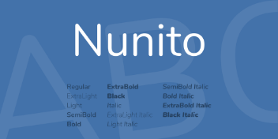
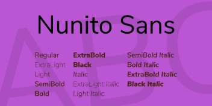

# 

Identidade visual - Brasil contra o vírus

O movimento Brasil Contra o Vírus tem uma identidade visual própria. Aqui apresentamos sua logo, sua paleta de cores e sua tipografia para que a identidade possa ser aplicada de maneira adequada em páginas web e peças gráficas.

A logo

A logo do movimento Brasil Contra o Vírus representa a união da população brasileira no combate ao Covid-19. A logo faz uso de diversas cores que representativas da diversidade da população do Brasil, mas em sua aplicação é importante atentar-se que existem diferentes versões para fundos claros e fundos escuros, como representadas na imagem abaixo:

Aplicação da logo colorida em fundo claro

Aplicação da logo colorida em fundo escuro

Além de sua versão colorida, a logo do movimento Brasil Contra o Vírus também conta com sua versão preto e branco:

Aplicação da logo colorida em fundo claro

Aplicação da logo colorida em fundo escuro

Para aplicações em tamanhos reduzidos, recomenda-se, por questões de legibilidade, que seja utilizada a abreviação da logo do movimento Brasil Contra o Vírus:

[Faça aqui o download da logo do Movimento Brasil Contra o Vírus.](#)

---

A paleta de cores

A paleta do movimento Brasil Contra o Vírus conta com 18 gradientes e 2 cores sólidas. Para aplicação da paleta de cores, basta copiar os códigos hexadecimais das cores abaixo:

| vermelhor | laranja | amarelo | verde | 
| #C80707 #A00707 | #FF8D1D #FF5A1D | #EEE600 #EEE600 | #EEE600 #EEE600 | 
| azul claro | azul escuro | roxo | rosa | 
|  #00D2EB #0092EB | #064BD8 #062BB3 | #840BFF #5D0BE1 | #F877FD #F877FD | 
| marrom 1 | marrom 2 | marrom 3 | marrom 4 | 
| #A56945 #A56945 | #96564A #482110 | #C78054 #C78054 | #A56945 #A56945 | 
| marron 5 | marron 6 | marron 7 | marron 8 | 
| #FDD0B0 #FDD0B0 | #D69C6D #D69C6D | #FDECE5 #F4CE99 | #FDD0B0 #E7A788| 
| cinza claro | cinza escuro | preto | branco | 
| #BABABA #999999 | #757575 #3E3E3E | #000000 | #FFFFFF | 

---

A tipografia

As tipografias utilizadas na identidade visual do movimento Brasil Contra o Vírus são a Nunito e a Nunito Sans. Para títulos recomenda-se o uso da Nunito em negrito. Para corpos de textos, recomenda-se o uso da Nunito Sans Regular. Por ser gratuita, é possível adquirir a tipografia por meio do Google Fonts.

[Baixar a Nunito](#)

[Baixar a Nunito](#)