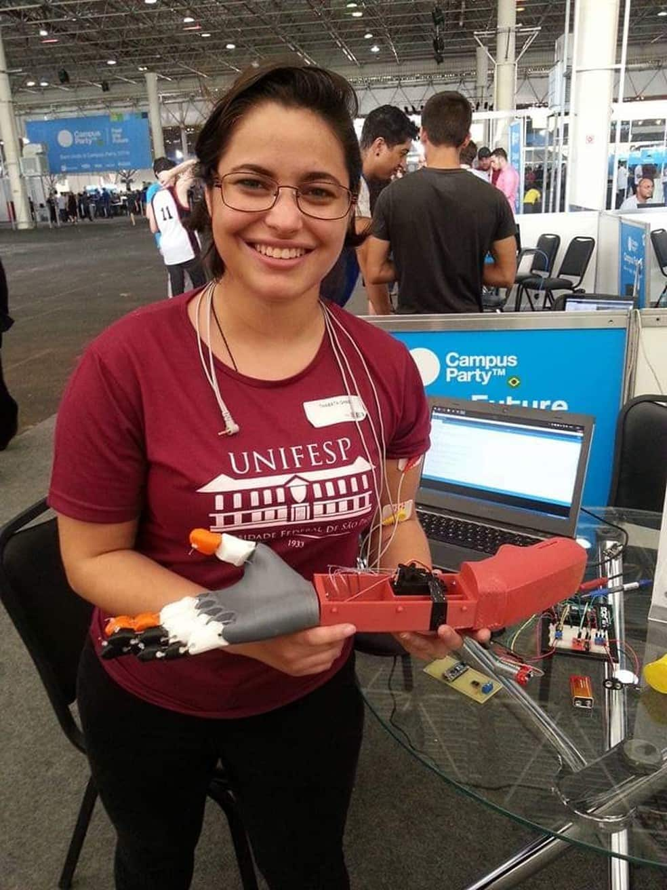

## Saúde do Futuro - COVID-19

Projeto focado em buscar o melhores profissionais do Brasil para unificar forças no comabte a pandemia do Corona Vírus.

### Quer saber mais?
####  [Brasileira cria rede para imprimir em 3D equipamentos de UTI usados no tratamento contra o coronavírus](https://g1.globo.com/bemestar/coronavirus/noticia/2020/03/20/brasileira-cria-rede-para-imprimir-em-3d-equipamentos-de-uti-usados-no-tratamento-contra-o-coronavirus.ghtml)

### Grupos
####  Telegram
-  [Modelagem](https://t.me/joinchat/LBLmhxklKYs76TRa1hpp5Q)
-  [Impressão e Prototipagem](https://t.me/joinchat/LBLmhxwfhBlw6cDAQPtOWQ)
-  [Insumos para produção](https://t.me/joinchat/LBLmhx3IVZ-U4xVBiorQzA)
-  [Usinagem e produção](https://t.me/joinchat/LBLmhxizI7tuUH0M68FPJw)
-  [Tecnologia da Informação](https://t.me/joinchat/LBLmhxrS6ul9KmTAq5a2mQ)
-  [Engenharia e Biomedicina](https://t.me/joinchat/QkdZghpiAJ7hFevyUP3g1g)
-  [Legislação](https://t.me/joinchat/QkdZghsvjF1eCvF2DxvBXg)
-  [Hospitais e Gestores Públicos](https://t.me/joinchat/QkdZghfxTnK5XyeL6vu4oA)

####  Slack
- https://saudedofuturo.slack.com/

### Tem conhecimento técnico para ajudar?

- Preencha o [formulário de inscrição](https://docs.google.com/forms/d/1kO4vSgMaD9xD0hKg7rNoqE9EknlJQUj0Rc2Tj3A9Q4c/viewform?edit_requested=true)

### Ideias

### Créditos
#### Idealizadora:

@thabataganga

 [Twitter](https://twitter.com/thabataganga)

 [Linkedin](https://br.linkedin.com/in/thabataganga)

 [Instagram](https://www.instagram.com/thabataganga/?hl=pt-br)
