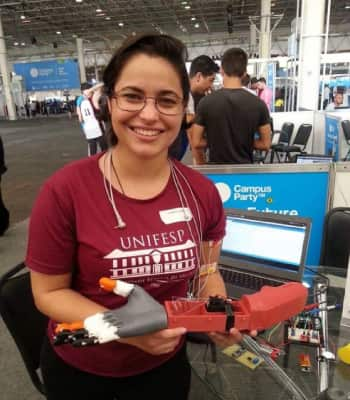

## Manifesto Brasil Contra o Vírus

_Através do trabalho solidário organizado e colaborativo entre profissionais, acadêmicos, cientistas, empresas, instituições públicas, privadas, ONGs e governo e outras organizações da sociedade, acreditamos que podemos fortalecer o SUS e superar a epidemia de COVID-19 no Brasil e no Mundo._

 

_Estamos desenvolvendo tecnologias emergentes, produzindo equipamentos e suprimentos de forma solidária, sem fins lucrativos._

 

_Acreditamos que as ações do Movimento Brasil contra o Vírus têm a capacidade de melhorar de forma mais permanente a maneira como cientistas, empresas, makers e o poder público se relacionam, colocando a ciência e tecnologia a serviço da sociedade. Outras ameaças à vida e à humanidade exigem isso de nós._

 

_Acreditamos que a colaboração mútua na sociedade, assim como as ferramentas modernas que libertam, como software, hardware e sistemas abertos e livres, contribuem substancialmente para a difusão de conhecimento e oportunidades entre todos de forma solidária, aberta e fraterna, especialmente para a geração de tecnologia e desenvolvimento sem a capacidade financeira da indústria._

 

_Por fim, acreditamos que a união da Ciência e Tecnologia, além do conhecimento colaborativo podem ajudar a melhorar o planeta e as pessoas, superando os desafios que se colocam para a humanidade._

 

Thabata Ganga, André Skortzaru, Rita Wu e Gabriel Radamés

---

### Deu na mídia

 |  | [Brasileira cria rede para imprimir em 3D equipamentos de UTI usados no tratamento contra o coronavírus](https://g1.globo.com/bemestar/coronavirus/noticia/2020/03/20/brasileira-cria-rede-para-imprimir-em-3d-equipamentos-de-uti-usados-no-tratamento-contra-o-coronavirus.ghtml "Reportagem")     Thabata é engenheira biomédica especialista em próteses de impressão 3D para crianças. Agora ela quer ajudar pacientes de Covid-19 que precisarem de equipamentos hospitalares como respiradores artificiais.     [Leia Mais](https://g1.globo.com/bemestar/coronavirus/noticia/2020/03/20/brasileira-cria-rede-para-imprimir-em-3d-equipamentos-de-uti-usados-no-tratamento-contra-o-coronavirus.ghtml)

---

### Grupos

####  &nbsp; Telegram
-  [Modelagem](https://t.me/joinchat/LBLmhxklKYs76TRa1hpp5Q)
-  [Impressão e prototipagem](https://t.me/joinchat/LBLmhxwfhBlw6cDAQPtOWQ)
-  [Insumos para produção](https://t.me/joinchat/LBLmhx3IVZ-U4xVBiorQzA)
-  [Usinagem e produção](https://t.me/joinchat/LBLmhxizI7tuUH0M68FPJw)
-  [Tecnologia da Informação](https://t.me/joinchat/LBLmhxrS6ul9KmTAq5a2mQ)
-  [Engenharia e Biomedicina](https://t.me/joinchat/QkdZghpiAJ7hFevyUP3g1g)
-  [Legislação](https://t.me/joinchat/QkdZghsvjF1eCvF2DxvBXg)
-  [Hospitais e gestores públicos](https://t.me/joinchat/QkdZghfxTnK5XyeL6vu4oA)

 

####  &nbsp; Slack
- [saudedofuturo.slack.com](https://saudedofuturo.slack.com/)

---

### Idealizadora:

 | @thabataganga      [Twitter](https://twitter.com/thabataganga)    [Linkedin](https://br.linkedin.com/in/thabataganga)    [Instagram](https://www.instagram.com/thabataganga/?hl=pt-br) | &nbsp;
